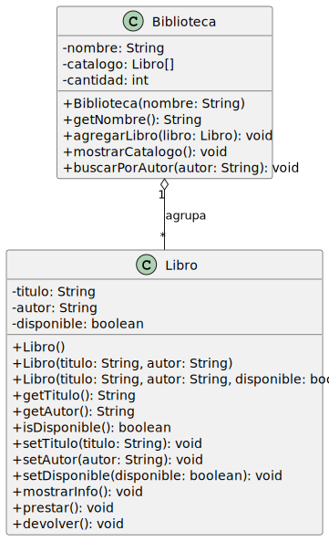

# Ejercicio Agregación: Biblioteca y Libro

**"Un objeto contiene a otros, pero las partes pueden existir sin él."**

Es una composición más débil. El todo agrupa a las partes, pero si el todo desaparece, las partes siguen existiendo. Ejemplo: una `Biblioteca` tiene `Libros`. Si la biblioteca cierra, los libros siguen existiendo.

> Los libros se crean fuera de la biblioteca y se le pasan desde afuera. Si la biblioteca desaparece, los libros siguen existiendo. Eso es **agregación**.

## Descripción

Este ejercicio modela la relación entre una `Biblioteca` y sus `Libro`s. Los libros se crean de forma independiente y luego se agregan a la biblioteca. Si la biblioteca desaparece, los libros siguen existiendo.

Este tipo de relación se llama **agregación**.

## Clases

- `Libro` — representa un libro con título, autor y disponibilidad.
- `Biblioteca` — representa una biblioteca que agrupa libros creados externamente.
- `App` — clase principal donde se crean los objetos y se prueba la interacción.

## Diagrama UML

<!-- Generar SVG con: java -jar plantuml.jar -tsvg README.md -->

<!--
```
@startuml agregacion-biblioteca-libro
skinparam classAttributeIconSize 0

class Libro {
    - titulo: String
    - autor: String
    - disponible: boolean
    + Libro()
    + Libro(titulo: String, autor: String)
    + Libro(titulo: String, autor: String, disponible: boolean)
    + getTitulo(): String
    + getAutor(): String
    + isDisponible(): boolean
    + setTitulo(titulo: String): void
    + setAutor(autor: String): void
    + setDisponible(disponible: boolean): void
    + mostrarInfo(): void
    + prestar(): void
    + devolver(): void
}

class Biblioteca {
    - nombre: String
    - catalogo: Libro[]
    - cantidad: int
    + Biblioteca(nombre: String)
    + getNombre(): String
    + agregarLibro(libro: Libro): void
    + mostrarCatalogo(): void
    + buscarPorAutor(autor: String): void
}

Biblioteca "1" o-- "*" Libro : agrupa
@enduml
```
-->



## Instrucciones

1. Reutiliza la clase `Libro` con todos sus constructores, getters, setters y métodos.
2. Crea la clase `Biblioteca` con los atributos `nombre`, `catalogo` (arreglo de máximo 10 libros) y `cantidad` como `private`.
3. Agrega un constructor que reciba `nombre`. El catálogo inicia vacío y `cantidad` en 0.
4. Agrega getter para `nombre`.
5. Implementa `agregarLibro(Libro libro)`: agrega el libro al arreglo e incrementa `cantidad`. Si el catálogo está lleno, avisa.
6. Implementa `mostrarCatalogo()`: imprime el nombre de la biblioteca y llama a `mostrarInfo()` de cada libro registrado.
7. Implementa `buscarPorAutor(String autor)`: recorre el catálogo e imprime los títulos de los libros cuyo autor coincida. Si no hay ninguno, avisa.

## En `App.java`

1. Crea tres objetos `Libro` **fuera** de la biblioteca, antes de crearla.
2. Crea una `Biblioteca` y agrégale los tres libros con `agregarLibro()`.
3. Muestra el catálogo completo con `mostrarCatalogo()`.
4. Busca libros por un autor que sí exista en el catálogo.
5. Busca libros por un autor que no exista.

## Salida esperada

```
Libro "Cien años de soledad" agregado al catálogo.
Libro "El amor en los tiempos del cólera" agregado al catálogo.
Libro "El principito" agregado al catálogo.

=== Catálogo: Biblioteca Luis Ángel Arango ===
---- Libro ----
Título   : Cien años de soledad
Autor    : Gabriel García Márquez
Disponible: Sí

---- Libro ----
Título   : El amor en los tiempos del cólera
Autor    : Gabriel García Márquez
Disponible: Sí

---- Libro ----
Título   : El principito
Autor    : Antoine de Saint-Exupéry
Disponible: Sí

Libros de "Gabriel García Márquez":
  - Cien años de soledad
  - El amor en los tiempos del cólera

Libros de "Jorge Luis Borges":
  No se encontraron libros de ese autor.
```

## Pregunta para reflexionar

Los libros se crearon antes de que existiera la biblioteca y se le pasaron desde afuera. ¿En qué se diferencia eso de la composición del ejercicio anterior (Vuelo y Asiento)? ¿Cuál es la evidencia en el código de que esta relación es una agregación?